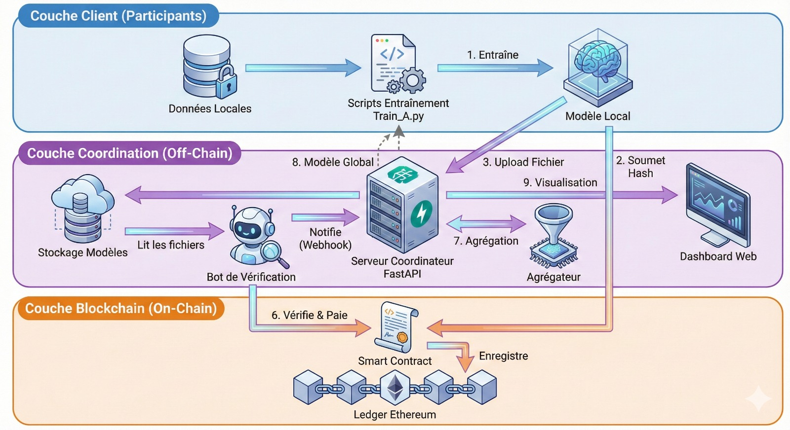
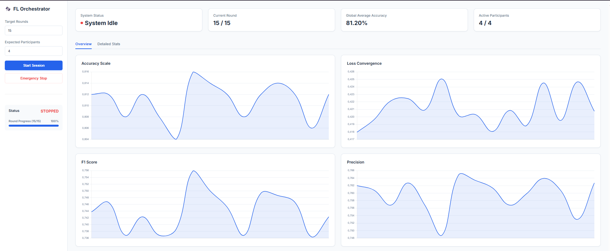
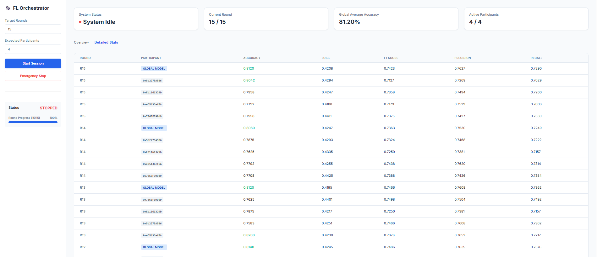
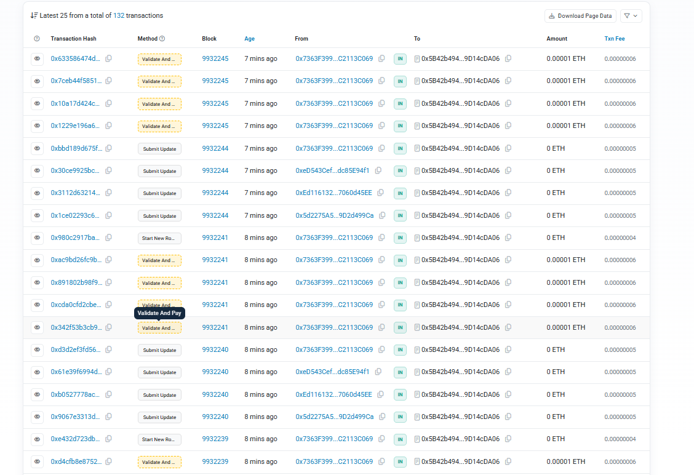
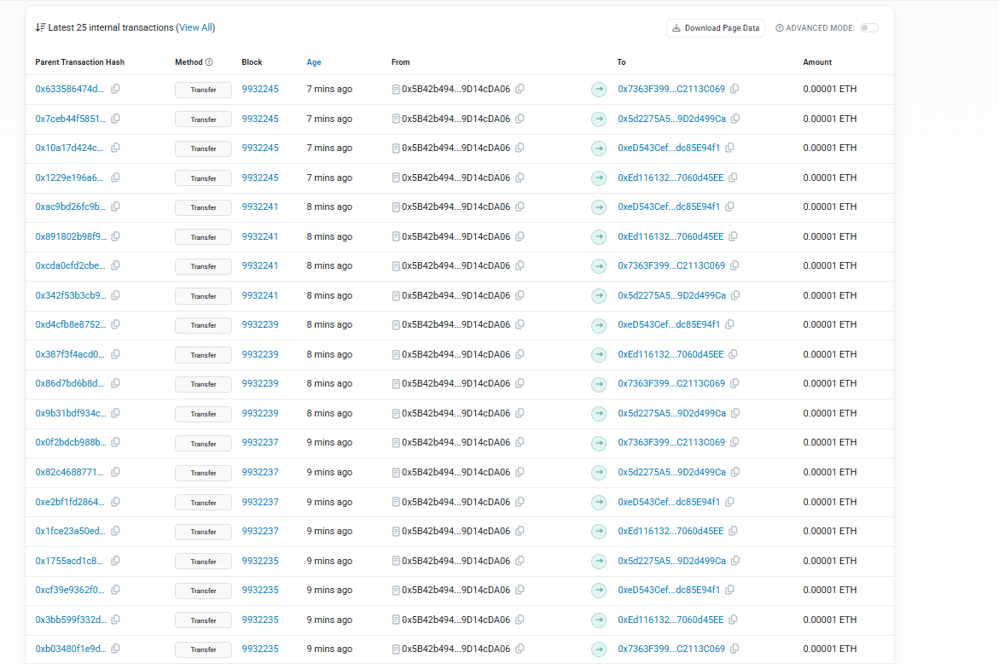
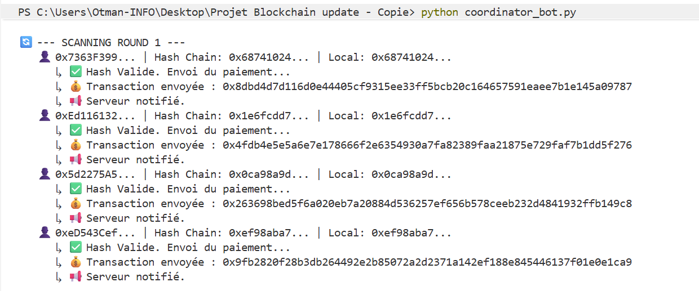
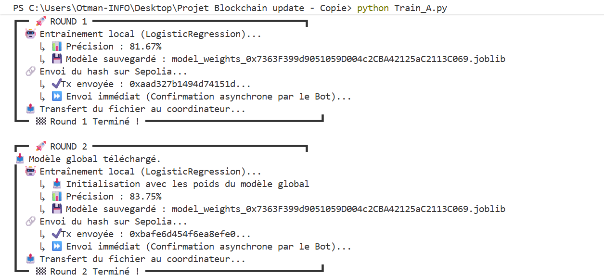

# 🌐 Blockchain-Mediated Decentralized Federated Learning

> **A Secure, Transparent, and Incentivized Framework for Distributed AI Training.**


## 📖 Board Overview

This project implements a robust **Federated Learning (FL)** system orchestrated by a **Smart Contract** on the Ethereum blockchain (Sepolia Testnet). It addresses the critical challenges of trust, transparency, and contribution verification in distributed AI.

Instead of a central authority blindly aggregating models, this system requires participants to **proof their contribution** on the blockchain. A Coordinator Server verifies these proofs against submitted model weights before aggregation, ensuring that only valid, committed learning updates enrich the Global Model.

### 🔑 Key Features

*   **🛡️ Immutable Audit Trail**: Every training round and model submission is recorded on the blockchain.
*   **🤝 Trustless Coordination**: Smart Contracts govern the state of training (Active/Inactive) and validate contributions.
*   **🤖 Automated Orchestration**: A `Coordinator Bot` acts as a bridge, listening to on-chain events to trigger server-side validations.
*   **📊 Real-Time Dashboard**: Visualize global model accuracy, participant statistics, and training progress live.
*   **🧠 Logistic Regression**: Optimized for tabular churn prediction data.

---

## 🏗️ Architecture

The system consists of three main pillars:



1.  **The Blockchain (Smart Contract)**:
    *   Acts as the "Timekeeper" for rounds.
    *   Stores hashes of participant models.
    *   Prevents tampering with submitted weights.

2.  **The Coordinator (Server & Bot)**:
    *   **Server (`FastAPI`)**: Aggregates models (FedAvg), evaluates global accuracy, and hosts the dashboard.
    *   **Bot**: Listens for `HashSubmitted` events on-chain and instructs the server to verify the corresponding off-chain file.

3.  **The Participants (`Clients`)**:
    *   **Train locally on their OWN private dataset.** Data never leaves the participant's device.
    *   Hash their local model.
    *   **Step 1**: Submit Hash to Blockchain -> **Step 2**: Upload Weights to Server.

---

## 📂 Project Structure

```bash
📦 Decentralized_Federated_AI_Training
 ┣ 📂 Images              # Screenshots for documentation (Architecture, Results)
 ┣ 📂 datasets            # Training data for participants
 ┣ 📂 received_models     # Temporary storage for uploaded user models
 ┣ 📂 static              # Global model storage and dashboard assets
 ┣ 📜 AICollaboration.sol # Solidity Smart Contract source code
 ┣ 📜 Dashboard.html      # Frontend for monitoring training
 ┣ 📜 Train_Participant.py     #Individual scripts simulating different participants
 ┣ 📜 coordinator_bot.py  # Automated bot for blockchain-server bridging
 ┗ 📜 server_coordinator.py # Main FastAPI server for aggregation & UI
```

---

## 📸 Results & Screenshots

### Dashboard Overview
Real-time monitoring of global model performance and participant contributions.


### Participant & Model Analysis
Detailed breakdown of individual model accuracy and validity.


### Blockchain Transparency
All transactions and payments are verifiable on-chain.
| Transaction History | Payment History |
|:---:|:---:|
|  |  |

### Training Process
Logs showing the automated coordination between Bot and Server.



---

## 🚀 Getting Started

### 📦 Prerequisites

*   **Python 3.10+**
*   **Ethereum Wallet**: A private key with Sepolia ETH (for gas fees).
*   **Infura/Alchemy URL**: An RPC endpoint for the Sepolia network.

### 🛠️ Installation

1.  **Clone the Repository**
    ```bash
    git clone https://github.com/your-repo/Decentralized_Federated_AI_Training.git
    cd Decentralized_Federated_AI_Training
    ```

2.  **Install Dependencies**
    ```bash
    pip install -r requirements.txt
    ```

3.  **Environment Configuration**
    Create a `.env` file in the root directory (or update the variables in the scripts if hardcoded for testing):
    ```env
    RPC_URL="https://sepolia.infura.io/v3/YOUR_INFURA_KEY"
    PRIVATE_KEY="YOUR_WALLET_PRIVATE_KEY"
    CONTRACT_ADDRESS="0x..." # Deployed Contract Address
    SERVER_URL="http://127.0.0.1:8000"
    ```

---

## 🏃 Usage Guide

### 1. Start the Coordinator Server
This initializes the central aggregator and dashboard.
```bash
python server_coordinator.py
```
*Access the dashboard at: `http://127.0.0.1:8000/static/Dashboard.html`*

### 2. Launch the Coordinator Bot
This bot connects the Blockchain events to the Server API.
```bash
python coordinator_bot.py
```

### 3. Launch Participants
Open separate terminals for each client. They will automatically wait for the round to start.
```bash
# In a real environment, each participant runs this on their own machine with their own data.
python Train_Participant.py 

# ...
```

### 4. Start the Training Session
You can start the session via an API call or the dashboard (if configured), or let the server auto-start if pre-configured.
*   The **Bot/Server** will trigger `startNewRound()` on the Blockchain.
*   **Clients** detect `Round 1`, train, and submit tasks.
*   **Server** aggregates and updates the Global Model.

---

## 🔍 Technical Details

### Smart Contract (`AICollaboration.sol`)
*   `startNewRound()`: Increments round, enables training.
*   `submitUpdate(bytes32 _hash)`: Participants lock their model version.
*   `validateAndPay()`: Coordinator marks contribution as valid (optional token logic).

### Tech Stack
*   **Backend**: Python, FastAPI
*   **ML Core**: Scikit-Learn (Logistic Regression), Pandas, Numpy
*   **Web3**: Web3.py, Solidity

---

## 📜 License

This project is licensed under the MIT License - see the [LICENSE](LICENSE) file for details.

---

*Verified by [Your Name/Organization]*
